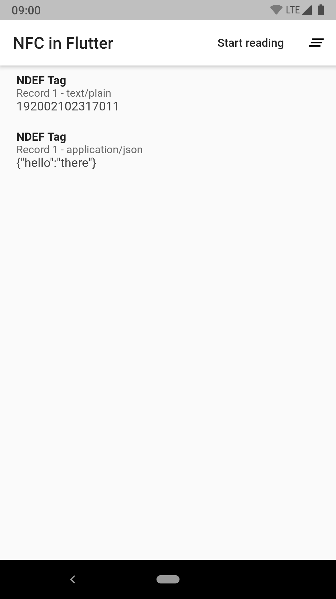

# NFC in Flutter example

An example application to demonstrate NFC in Flutter.



It is easiest to run the app on an Android device as the iOS simulator can't do NFC and running it on a real device requires a bunch of code signing nonsense.

```shell
$ flutter run
```

## Implementation

The app has a button in the top right corner that starts or stops listening for NFC tags.

```dart
RaisedButton(
    child: Text(reading ? "Stop reading" : "Start reading"),
    onPressed: () {
        if (!reading) {
            setState(() {
                reading = true;
                session = NFC.readNDEF()
                    .listen((tag) {

                    });
            });
        } else {
            session?.cancel();
            setState(() {
                reading = false;
            });
        }
    }
);
```

When a tag is scanned, it inserts it in a list of scanned tags, which is then rendered in a `ListView`.

```dart
NFC.readNDEF()
    .listen((tag) (
        setState(() {
            tags.insert(0, tag);
        });
    ));
```

When an error occurs it will show an `AlertDialog`, unless the error is a `NFCMultiUserCanceledSessionException`.

```dart
NFC.readNDEF()
    .listen((tag) {
        // ...
    }, onError: (error) {
        if (!(error is NFCMultiUserCanceledSessionException)) {
            // It is up to you how many exceptions you want to check for.
            showDialog(
                context: context,
                builder: (context) => AlertDialog(
                    title: const Text("Error!"),
                    content: Text(e.toString()),
                ),
            );
        }
    });
```